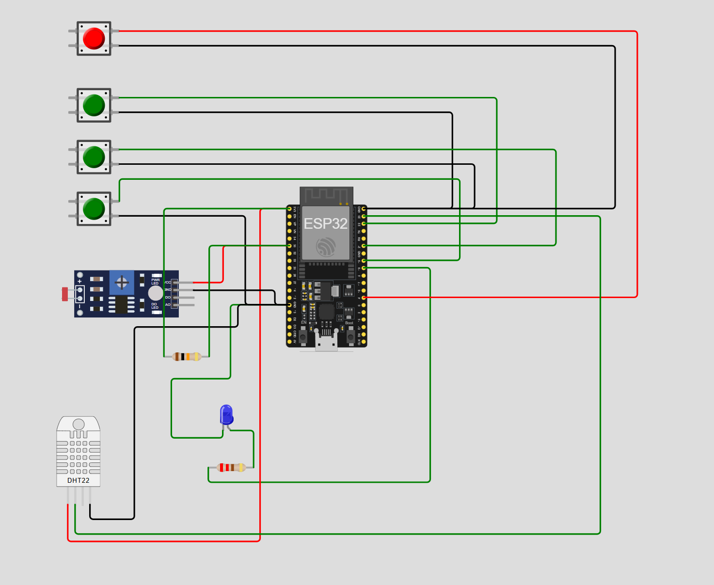

# FIAP - Faculdade de Informática e Administração Paulista

 

# Sistema de Monitoramento de Perdas na Colheita de Cana-de-Açúcar

## Grupo: AgroTech Solutions

## 👨‍🎓 Integrantes: 
- <a href="https://www.linkedin.com/in/gabriel-oliveira-b6353a16b/">Gabriel Oliveira dos Santos</a>
- <a href="https://www.linkedin.com/in/roberson-pedrosa-304ab523a/">Roberson Pedrosa de Oliveira Junior</a>
- <a href="https://www.linkedin.com/in/arthur-bruttel-7171b8381">Arthur Bruttel Nascimento</a> 
- <a href="https://www.linkedin.com/in/jonviotti/">Jonatan Viotti Rodrigues da Silva</a> 
- <a href="https://www.linkedin.com/in/eusamuelrocha/">Samuel Nicolas Oliveira Rocha</a>

## 👩‍🏫 Professores:
### Tutor(a) 
- <a href="https://www.linkedin.com/in/sabrina-otoni-22525519b/">Sabrina Otoni</a>
### Coordenador(a)
- <a href="https://www.linkedin.com/company/inova-fusca">André Godoi Chiovato</a>

## 📜 Descrição

# 🍓 Sistema de Irrigação Inteligente para Morango (Wokwi/ESP32)

Este projeto simula um sistema de irrigação automatizado e inteligente, implementado em um ESP32 (Wokwi), focado nas necessidades específicas da cultura do **Morango** (*Fragaria × ananassa*). O objetivo é ligar a bomba d'água (LED azul) **apenas** quando o solo precisa de água e as condições de crescimento (NPK e pH) são ideais para a planta.

## ⚙️ Componentes e Pinos Utilizados

| Componente (Simulado) | Pino ESP32 (GPIO) | Função no Projeto |
| :--- | :--- | :--- |
| **Umidade** (DHT22) | **D23** | Sensor de Umidade e Temperatura. |
| **PH** (LDR) | **D35 (ADC)** | Simula o pH do solo através da leitura analógica. |
| **Bomba d'Água** (LED Azul) | **D18** | Saída para acionar a irrigação. |
| **Nitrogênio (N)** | **D22** (Botão Verde 1) | Simula a presença/ausência do nutriente N (NPK OK = Não pressionado). |
| **Fósforo (P)** | **D21** (Botão Verde 2) | Simula a presença/ausência do nutriente P (NPK OK = Não pressionado). |
| **Potássio (K)** | **D19** (Botão Verde 3) | Simula a presença/ausência do nutriente K (NPK OK = Não pressionado). |
| **Gatilho de Verificação** | **D4** (Botão Vermelho) | Inicia o ciclo de medição e decisão. |

## 📸 Diagrama do Circuito (Wokwi.com)

O diagrama a seguir demonstra as conexões físicas entre o ESP32, os sensores (DHT22 e LDR/pH), a bomba d'água (LED) e os botões NPK/Gatilho.

# 🍓 Sistema de Irrigação Inteligente para Morango (Wokwi/ESP32)

Este projeto simula um sistema de irrigação automatizado e inteligente, implementado em um ESP32 (Wokwi), focado nas necessidades específicas da cultura do **Morango** (*Fragaria × ananassa*). O objetivo é ligar a bomba d'água (LED azul) **apenas** quando o solo precisa de água e as condições de crescimento (NPK e pH) são ideais para a planta.

## ⚙️ Componentes e Pinos Utilizados

| Componente (Simulado) | Pino ESP32 (GPIO) | Função no Projeto |
| :--- | :--- | :--- |
| **Umidade** (DHT22) | **D23** | Sensor de Umidade e Temperatura. |
| **PH** (LDR) | **D35 (ADC)** | Simula o pH do solo através da leitura analógica. |
| **Bomba d'Água** (LED Azul) | **D18** | Saída para acionar a irrigação. |
| **Nitrogênio (N)** | **D22** (Botão Verde 1) | Simula a presença/ausência do nutriente N (NPK OK = Não pressionado). |
| **Fósforo (P)** | **D21** (Botão Verde 2) | Simula a presença/ausência do nutriente P (NPK OK = Não pressionado). |
| **Potássio (K)** | **D19** (Botão Verde 3) | Simula a presença/ausência do nutriente K (NPK OK = Não pressionado). |
| **Gatilho de Verificação** | **D4** (Botão Vermelho) | Inicia o ciclo de medição e decisão. |

## 📸 Diagrama do Circuito (Wokwi.com)

O diagrama a seguir demonstra as conexões físicas entre o ESP32, os sensores (DHT22 e LDR/pH), a bomba d'água (LED) e os botões NPK/Gatilho.

## 🌱 Especificações da Cultura: Morango

O Morango é uma cultura sensível que requer solo **ácido** e umidade constante, mas sem excesso.

| Parâmetro | Requisito da Cultura | Faixa de Decisão no Código V8 |
| :--- | :--- | :--- |
| **Umidade do Solo** | Manter sempre úmido. | **< 40%** (Precisa Regar) |
| **PH do Solo** | Solo **ácido** (ideal 5.5 a 6.5). | **1024 a 2048** (Escala analógica de 0-4095) |
| **NPK** | Alto requisito de P e K. | **Todos OK** (Nenhum botão de N, P ou K pressionado) |

## 🧠 Lógica de Decisão (C/C++)

A lógica implementada garante que a bomba só seja acionada em condições de **necessidade** (água baixa) **E** **qualidade** (pH e NPK adequados). A rega é um evento de 3 segundos acionado pelo botão D4 (Gatilho).

## 🌱 Especificações da Cultura: Morango

O Morango é uma cultura sensível que requer solo **ácido** e umidade constante, mas sem excesso.

| Parâmetro | Requisito da Cultura | Faixa de Decisão no Código V8 |
| :--- | :--- | :--- |
| **Umidade do Solo** | Manter sempre úmido. | **< 40%** (Precisa Regar) |
| **PH do Solo** | Solo **ácido** (ideal 5.5 a 6.5). | **1024 a 2048** (Escala analógica de 0-4095) |
| **NPK** | Alto requisito de P e K. | **Todos OK** (Nenhum botão de N, P ou K pressionado) |

## 🚀 Instruções de Execução e Teste

Para testar a lógica completa, utilize a seguinte sequência no simulador Wokwi:

1.  **Iniciar:** Clique em **Start Simulation**.
2.  **Preparação:** Mantenha os botões N, P e K **não pressionados**.
3.  **Umidade (DHT22):** Ajuste o slider do DHT22 para um valor **ABAIXO de 35%** (ex: 20%).
4.  **PH (LDR):** Insira ou faça a leitura do valor LDR via Monitor Serial para que ele fique **entre 1548 e 2548**.
5.  **Gatilho:** Pressione o **Botão Vermelho (D4)**.

**Resultado:** O LED Azul (Bomba) deve acender e o Monitor Serial deve exibir a mensagem **`>> REGANDO: Umidade Baixa, NPK e pH OK. <<`**.

---

## 📋 Licença

<a property="dct:title" rel="cc:attributionURL" href="https://github.com/agodoi/template">MODELO GIT FIAP</a> por <a rel="cc:attributionURL dct:creator" property="cc:attributionName" href="https://fiap.com.br">Fiap</a> está licenciado sobre <a href="http://creativecommons.org/licenses/by/4.0/?ref=chooser-v1" target="_blank" rel="license noopener noreferrer" style="display:inline-block;">Attribution 4.0 International</a>.

---
